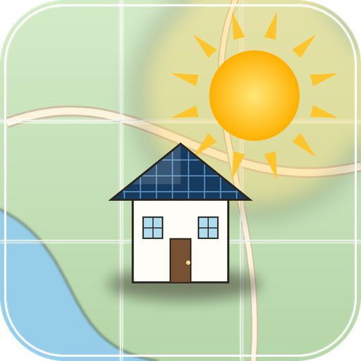

# Solkart for Home Assistant

<p align="center">
  
</p>

[](https://github.com/hacs/integration)
[](https://github.com/lordblc/ha-solkart/actions/workflows/validate.yaml)

Home Assistant integration for the Norwegian solar-forecast service
[**Solkart**](https://solkart.no/api). It turns the Solkart API into PV power and
energy forecast sensors and can feed Home Assistant's **Energy dashboard** as a
solar production forecast.

Designed to run comfortably on Solkart's **free tier** — a single API request per
update covers all of your panel arrays.

> Coverage area: 57–72°N, 4–32°E (Norway and surroundings).

## Features

- ☀️ Power production **now** (interpolated), plus next hour
- 🔋 Energy **today**, **today remaining**, and **tomorrow**
- ⏱️ Energy **current hour** / **next hour**
- 📈 **Peak production time** today and tomorrow
- 🌤️ Global horizontal irradiance (**GHI**) now
- 🧩 **Multiple panel arrays** (e.g. east/west split) in a single API call
- ⚡ **Energy dashboard** integration (Solkart appears as a solar production forecast)
- 🇳🇴 English and Norwegian (Bokmål) translations
- 🛠️ Diagnostics download with secrets redacted

The full hourly forecast series is attached as an attribute on the
*Power production now* sensor (`forecast`) for use in ApexCharts and templates.

## Installation

### HACS (recommended)

1. In HACS, open the three-dot menu → **Custom repositories**.
2. Add `https://github.com/lordblc/ha-solkart` with category **Integration**.
3. Search for **Solkart**, install, and **restart Home Assistant**.

### Manual

Copy `custom_components/solkart/` into your Home Assistant `config/custom_components/`
directory and restart Home Assistant.

## Configuration

1. Get a free API key at <https://solkart.no/api>.
2. **Settings → Devices & Services → Add Integration → Solkart**.
3. Enter your **API key**; latitude/longitude default to your Home Assistant location.
4. Add one or more **panel arrays**. For each array provide:
   - **Name** (e.g. `Sør`, `Øst`, `Vest`)
   - **kWp** — installed power
   - **Tilt** — `0°` flat … `90°` vertical
   - **Azimuth** — `0°` N, `90°` E, **`180°` S**, `270°` W
   - Tick **Add another array** to chain several roof faces in one go.

### Options

Settings → the Solkart entry → **Configure**:

| Option | Default | Notes |
| --- | --- | --- |
| Performance ratio | `0.85` | System efficiency 0–1 |
| Update interval | `60 min` | Keep high on the free tier to stay within quota |
| From midnight (`daily`) | off | **Basic+ only** — ignored on free tier |
| 10-day forecast (`extended`) | off | **Basic+ only** — ignored on free tier |

## Sensors

| Entity | Unit | Description |
| --- | --- | --- |
| Power production now | W | Interpolated current PV power (+ `forecast` attribute) |
| Power production next hour | W | PV power one hour ahead |
| Solar irradiance now | W/m² | GHI, interpolated |
| Energy production today | kWh | Today's total (best-effort on free tier — see below) |
| Energy production today remaining | kWh | Remaining today (current hour prorated) |
| Energy production tomorrow | kWh | Tomorrow's total |
| Energy current hour | kWh | This hour's production |
| Energy next hour | kWh | Next hour's production |
| Highest power peak time today | timestamp | When today peaks |
| Highest power peak time tomorrow | timestamp | When tomorrow peaks |
| `<array>` power | W | Per-array power *(only when you have >1 array)* |
| Peak power | W | System peak over the forecast window *(diagnostic)* |
| Forecast cycle time | timestamp | Model run the data came from *(diagnostic)* |

## Energy dashboard

After setup, go to **Settings → Dashboards → Energy → Solar panels →
Add solar production** and pick **Solkart** as the *Solar production forecast*
for your solar sensor.

## Free tier & quota notes

- The free tier returns roughly **57–60 hours** of hourly forecast starting from
  the latest model cycle (not from midnight). Because of this, *Energy production
  today* may exclude early-morning hours that occurred before the latest cycle —
  *today remaining* and *tomorrow* are always complete.
- The API does not return rate-limit headers, so the integration polls
  conservatively (60 min default = 24 requests/day). If you see HTTP 429 in the
  logs, raise the **Update interval** in the options.
- `daily` (from-midnight) and `extended` (10-day) require a Basic+ subscription.

## Development & verification

The parsing and all derived-value math live in
[`custom_components/solkart/model.py`](custom_components/solkart/model.py) with **no
Home Assistant imports**, so they can be tested standalone:

```bash
python3 -m py_compile custom_components/solkart/*.py
SOLKART_API_KEY=sk_live_... python3 scripts/smoke_test.py   # live API + math checks
```

## Roadmap

- Edit existing arrays from the UI (config subentries)
- Adaptive polling
- `sites` / `forecast/latest` endpoints
- Logo in [home-assistant/brands](https://github.com/home-assistant/brands)

## Disclaimer

Not affiliated with Solkart. Solar forecasts are estimates. Use at your own risk.

## License

[MIT](LICENSE)
